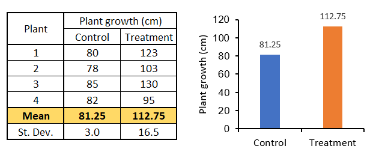
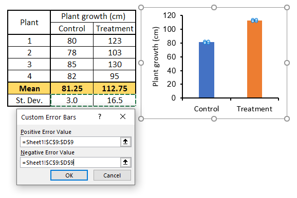

# Add error bars to bar graphs

## 1. Using Excel

Imagine you do an experiment with two groups of plants. You measure how much plants grow after a certain period of time without treatment (control) and with treatment. There are four plants for the control group and four plants for the treatment group. 

Your data look like this:

<figure>
    
</figure>
##### To add the standard deviation as error bars to your graph follow these steps:

1. Click on the chart to reveal the "Chart Elements" button
<figure>
    
</figure>

2. Click the "Chart Elements" button and navigate to "Error Bars" > "More Options..."
<figure>
     More Options">
</figure>

The "Format Error Bars" menu will open on the right-hand side of the Excel window.

3. Click on the "Error Bar Options" menu that looks like three vertical bars. Then, select the "Custom" error amount at the bottom and click on the "Specify Value" button.
<figure>
     Custom > Specify Value">
</figure>

4. A new window will appear that says "Custom Error Bars" at the top. In both, the "Positive Error Value" and "Negative Error Value" fields select the cells with your calculated standard deviations.
<figure>
    
</figure>

You are done! The error bars are now in your graph, and each bar has its corresponding error value.

---
## Additional resources
- [Microsoft Support: Add, change, or remove error bars in a chart](https://support.microsoft.com/en-us/office/add-change-or-remove-error-bars-in-a-chart-e6d12c87-8533-4cd6-a3f5-864049a145f0)

---
*Created by Juan Martinez-Francois.*

*These materials are open access and distributed under the terms of the [Creative Commons Attribution license](https://creativecommons.org/licenses/by/4.0/) (CC BY 4.0), which permits unrestricted use, distribution, and reproduction in any medium, provided the original author and source are credited.*

